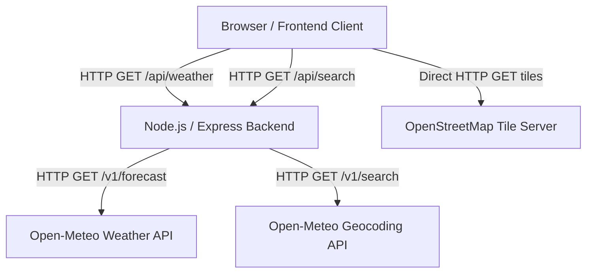

# ARCHITECTURE
## Weather Explorer

### 1. High-Level Architecture
The application follows a classic Client-Server model with a strong separation of concerns, heavily prioritizing frontend interactions while utilizing a lightweight Node.js backend as an API proxy.

### 2. Frontend Architecture (Vanilla JS)
The frontend is built without frameworks, relying on modular JavaScript files and a centralized state object.

- **State Management:** A single `state` object holds the application's current truth (user coordinates, selected coordinates, fetched weather data).
- **DOM Manipulation:** Manual updates via `document.getElementById` and `textContent`.
- **Event Listeners:** Attached to map interactions, search form submissions, and UI toggles.
- **Modularity:** Code is split by domain:
  - `app.js`: Entry point, initialization.
  - `map.js`: Leaflet integration, marker management.
  - `weather.js`: UI updates for weather cards and comparison.
  - `api.js`: Fetch wrappers for communicating with the Node backend.
  - `storage.js`: LocalStorage interactions for themes and recent searches.

### 3. Backend Architecture (Node.js/Express)
The backend serves two primary purposes: serving the static frontend files and acting as a proxy to the Open-Meteo APIs.

- **Static Serving:** Express `express.static('public')` to deliver HTML, CSS, and JS.
- **API Routes:**
  - `/api/health`: Basic status check.
  - `/api/weather`: Proxies requests to Open-Meteo forecast endpoint. Performs data normalization before sending it back to the client.
  - `/api/search`: Proxies requests to Open-Meteo geocoding endpoint.
- **Caching Layer (In-Memory):** To optimize API usage and improve performance, the backend implements a simple in-memory cache (e.g., storing weather for specific coordinates for 15 minutes) to prevent redundant external API calls.

### 4. Data Flow (Example: Map Click)
1. **User Action:** User clicks on the Leaflet map.
2. **Frontend Event:** Leaflet fires an `onclick` event with Lat/Lng.
3. **State Update:** Frontend updates `state.selectedLocation`.
4. **API Call:** Frontend calls `fetch('/api/weather?lat=X&lon=Y')`.
5. **Backend Processing:**
   - Checks cache for Lat/Lng.
   - If miss: Calls Open-Meteo API.
   - Normalizes Open-Meteo JSON into the specific format needed by the UI.
   - Caches the result.
6. **Backend Response:** Sends clean JSON to Frontend.
7. **UI Update:** Frontend updates the Selected Weather Card and the Comparison Table using the new data in `state`.
